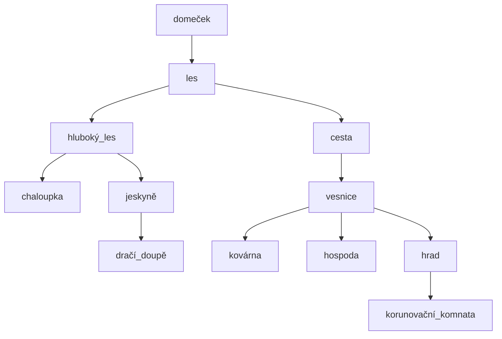

# Adventura

## Příběh

### Prostory

### Příběh

Karkulka jde na návštěvu k babičce. Cestou však potká zlého vlka, kterého musí skolit pomocí získaného meče. U babičky se dozví příběh, že na hradě chybí král a královna. Kdokoliv se může stát následovníkem, musí však porazit velkého draka a na hrad přinést jeho hlavu. Vypráví se, že je zamčený v dračím doupěti, nikdo však neví, kde se nachází. Cílem hry je, aby Karkulka překonala všechny překážky a stala se novou královnou.