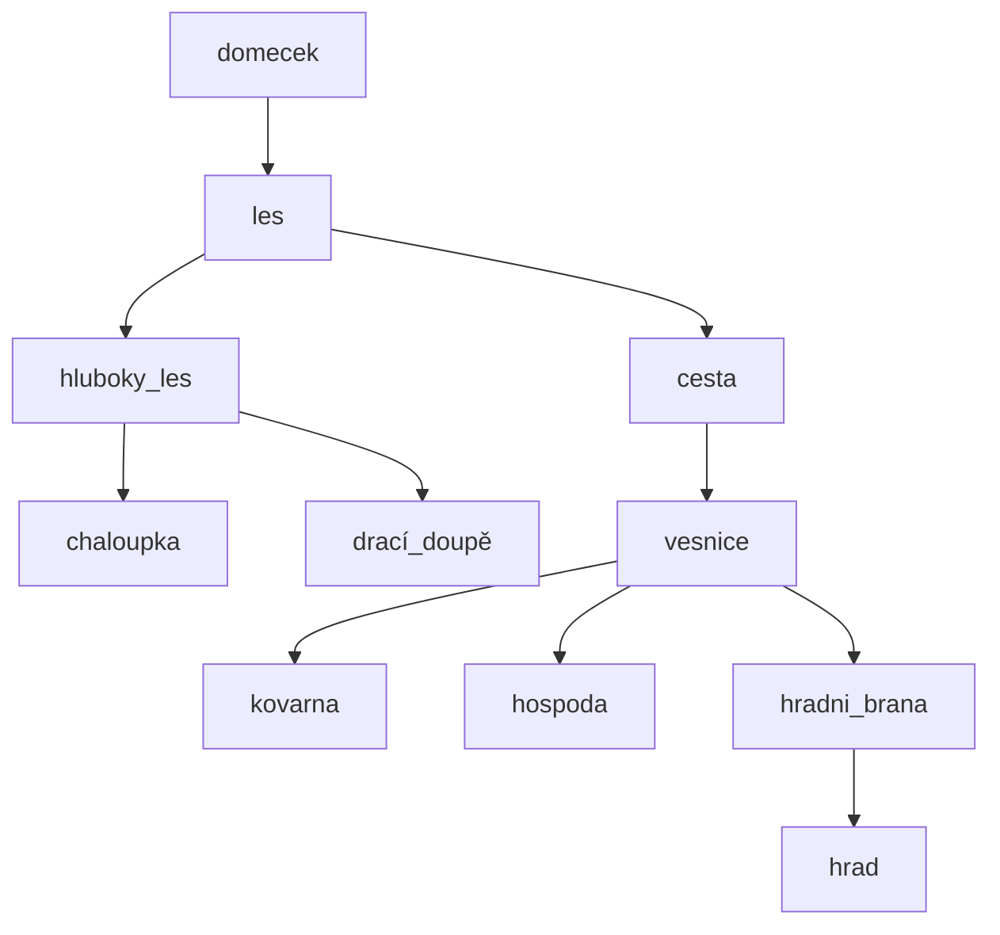

# Adventura

## Příběh

Adventura je jednoduchá textová hra, která probíhá v kouzelném prostředí lesa a okolní vesnice. Hráč se vžívá do role Červené karkulky, která se vydává na cestu za dobrodružstvím. Úkolem hráče je projít různými prostory, zabít draka a pomocí jeho hlavy byla připuštěna na hrad.

## Prostory

## Postavy

- **Drak**: V prostoru **draci_doupe**, hráč musí mít **meč**, po poražení se do prostoru vloží **dračí hlava**, drak z prostoru zmizne.
- **Stráž**: V prostoru **hradni_brana**, hráč musí mít **dračí hlavu** a následné odemčení hradu.
- **Babička**: V prostoru **chaloupka**, dá hráči **zlaťák**.
- **Obchodník**: V prostoru **cesta**, dá hráči **zlaťák** výměnou za **borůvky**.
- **Hospodský**: V prostoru **hospoda**, dá hráči **zlaťák** výměnou za **odpadlé paroží**.
- **Kovář**: v prostoru **kovarna**, dá hráči **meč** výměnou za **3 zlaťáky**.

## Příkazy

- **Jdi**: Přesune hráče do zadaného prostoru.
- **Konec**: Ukončí hru.
- **Napoveda**: Zobrazí nápovědu a seznam dostupných příkazů.
- **Misto**: Zobrazí aktuální prostor, ve kterém se hráč nachází a okolní východy.
- **Interakce**: Interakce s postavami v prostoru.
- **Polozit**: Položení předmětu z batohu do prostoru.
- **Rozhlednout**: Výpis postav a věcí v aktuálním prostoru.
- **Seber**: Sebrání předmětu v aktuálním prostoru a vložení do batohu.
- **Obsah**: Zobrazení obsahu batohu hráče.

## Autor

- Jan Kornienko

## Verze

- Letní semestr 2024

## Poznámky a problémy při programování

- Nutnost herního plánu v příkazech pro získání aktuálního prostoru.
- Implementace dědičnosti pro příkaz a postavu.
- Měnící se pozdrav postav s použitím ENUM a aktuálního dne.
- Výhra po vstupu na hrad, příkaz jdi, nutno ukončit System.exit(0), aby se nedopisoval output příkazu.
- Zamknutý hrad.
- Směna mezi hráčem a postavou.